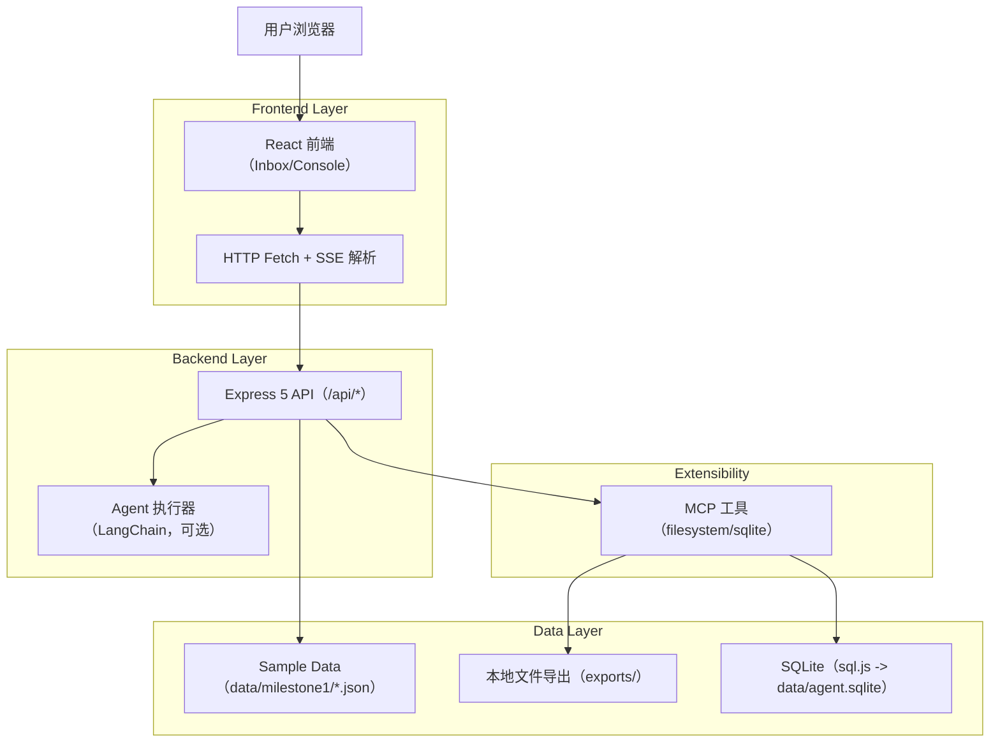
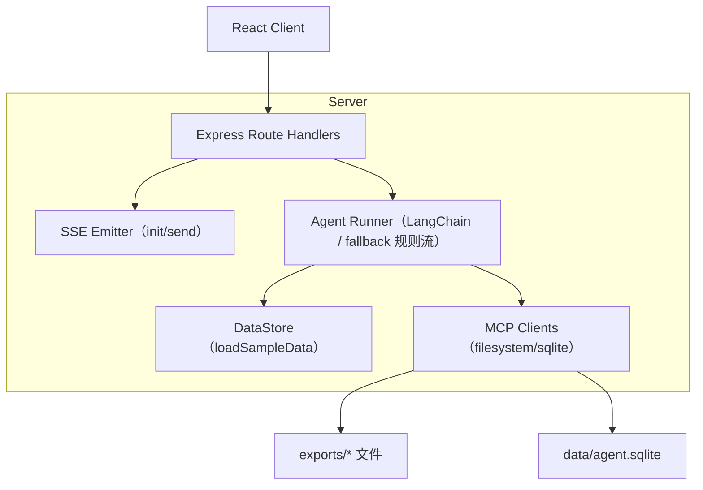
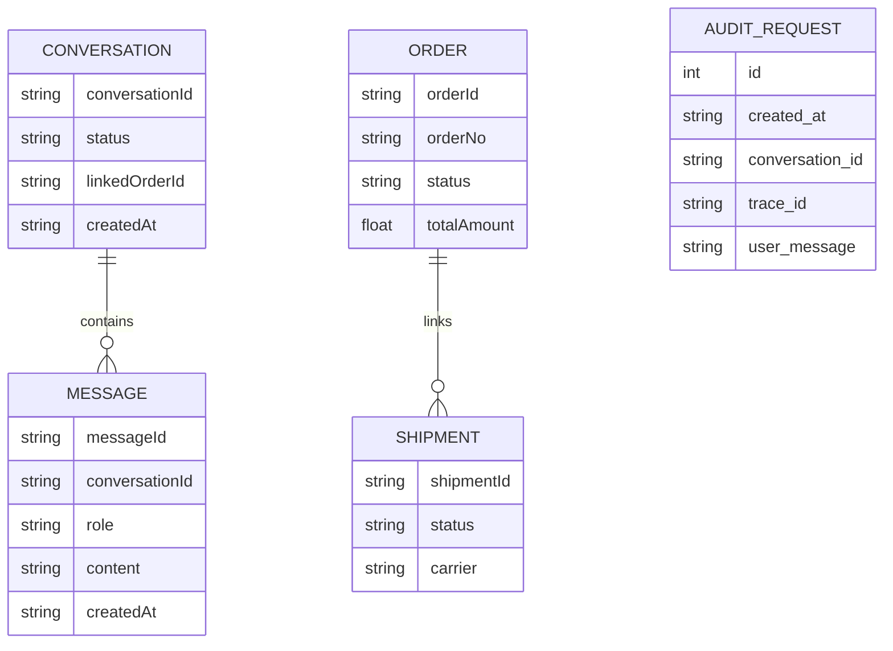

## 1.Architecture design


## 2.Technology Description
- 前端：React@19 + react-router-dom@7 + TypeScript + Vite（保持不变）
- 后端：Node.js + Express@5 + TypeScript（tsx）（保持不变）
- Agent：LangChain +（DeepSeek/OpenAI 兼容接口）+ Zod
- 实时通信：SSE（Server-Sent Events）
- 本地数据：json 演示数据 + sql.js（SQLite 持久化）

## 3.Route definitions
| Route | Purpose |
|---|---|
| / | 入口，重定向到 /inbox |
| /inbox | 会话列表页，进入单会话 Console |
| /console/:conversationId | 单会话处理台：对话、订单/物流侧栏、Plan、工具日志、MCP 操作 |

## 4.API definitions (If it includes backend services)
### 4.1 Core API
- 会话列表
  - `GET /api/conversations`
- 会话详情（含消息、订单、包裹）
  - `GET /api/conversations/:conversationId`
- 流式对话
  - `POST /api/chat/stream`

Request（JSON）：
| Param Name| Param Type | isRequired | Description |
|---|---|---|---|
| conversationId | string | true | 会话 ID |
| message | string | true | 用户输入文本 |
| context.orderId | string | false | 选定订单 ID（need_choice 后回传） |
| context.confirm | { action: string; payload: unknown } | false | need_confirm 后回传的确认信息 |

Response：SSE 事件流（`event:` + `data:`），核心事件包括：
- `plan_update` / `assistant_delta` / `tool_call` / `tool_result` / `need_choice` / `need_confirm` / `export_ready` / `sqlite_result` / `final` / `error`

## 5.Server architecture diagram (If it includes backend services)


## 6.Data model(if applicable)
### 6.1 Data model definition


### 6.2 Data Definition Language
SQLite 审计表（由 MCP sqlite_ddl 初始化）：
```
CREATE TABLE IF NOT EXISTS audit_requests (
  id INTEGER PRIMARY KEY AUTOINCREMENT,
  created_at TEXT NOT NULL,
  conversation_id TEXT NOT NULL,
  trace_id TEXT NOT NULL,
  user_message TEXT NOT NULL
);
```