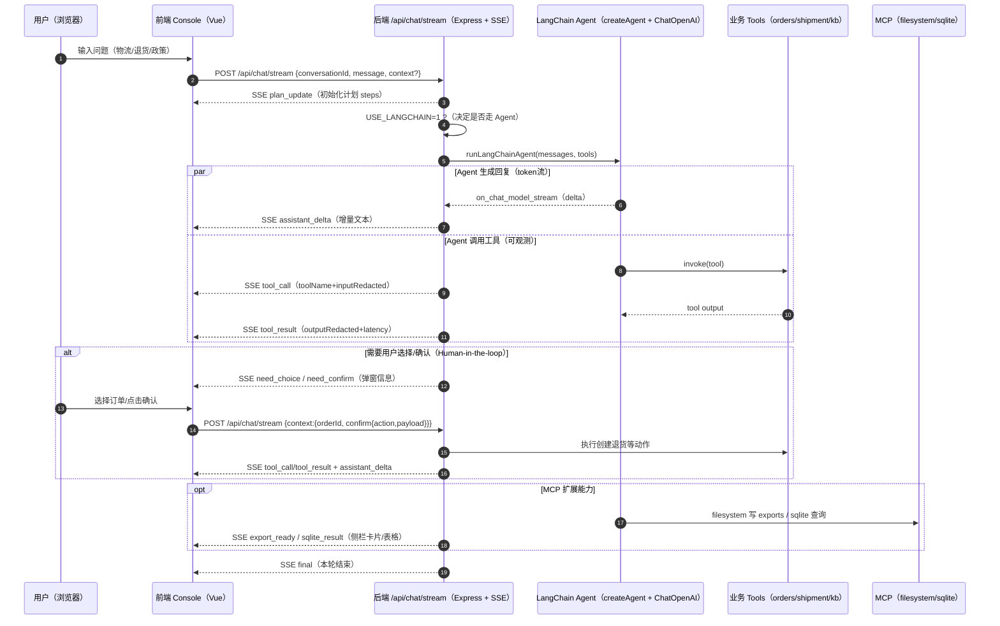

# Agent + LangChain 在 simbaAgent 中的工作方式

本文专门解释：simbaAgent 是如何把 LangChain Agent、业务工具（Tools）与前端工作台（Inbox/Console）结合起来的。重点是「可观测、可交互、可扩展」三件事。

## 总览

你可以把整个系统理解成一个事件驱动的闭环：

- 前端 Console 负责：发起对话、解析 SSE、把事件渲染为 UI（消息气泡/Plan/工具日志/弹窗/结果卡片）
- 后端负责：把一次对话组织为一个“可编排的 Agent 工作流”，并通过 SSE 把过程实时推回前端
- LangChain 负责：让模型（DeepSeek/OpenAI 兼容）在工具集合里做选择与调用，并生成最终答复
- MCP 负责：为 Agent 提供外部能力扩展（文件系统写入、SQLite 查询/审计）

## 关键时序（SSE 事件驱动）

## 入口：/api/chat/stream 如何切到 LangChain Agent

后端 SSE 接口：`POST /api/chat/stream`

- 代码位置：`server/index.ts`
- 行为：
  - 校验请求 body（conversationId/message/context）
  - `USE_LANGCHAIN=1` 时进入 LangChain Agent 路径
  - 若缺少 `OPENAI_API_KEY/DEEPSEEK_API_KEY`，会返回 `error` 事件并结束（但允许仅 MCP 命令的演示场景）

## LangChain 负责的部分

### 1) 模型层：DeepSeek/OpenAI 兼容

代码位置：`server/langchainAgent.ts` 的 `createModel()`

- 使用 `@langchain/openai` 的 `ChatOpenAI`
- 通过环境变量选择 DeepSeek 或 OpenAI 兼容 endpoint
- 开启 `streaming: true`，让模型能输出 token 增量（被转发为 `assistant_delta`）

### 2) Agent 层：createAgent + tools

代码位置：`server/langchainAgent.ts`

- 构造 `system prompt`：规定“事实必须来自工具、答复必须带引用、敏感操作不能乱做”等硬规则
- 组装 messages：带上最近几轮对话 + linkedOrderId 等上下文
- 创建 Agent：`createAgent({ model, tools })`
- 运行方式：
  - 优先使用 `agent.streamEvents`（如果支持），捕获 `on_chat_model_stream` 并把 delta 转成 SSE `assistant_delta`
  - 不支持时 fallback 到 `agent.invoke`

## Tools（工具）如何让 Agent “有手有脚”

你项目把业务能力封装成 LangChain 的 `tool(...)`，工具本身做两件事：

1) 执行业务查询/操作（这里用的是演示数据或 MCP）
2) 把“工具调用过程”通过 SSE 明确推给前端（可观测）

典型工具：

- `searchOrders`：用订单号/手机号后四位检索订单
- `getOrderDetail`：拉取订单详情（脱敏收货信息、金额、包裹ID）
- `getShipmentTracking`：查询物流轨迹
- `kbSearch`：检索政策/SOP 知识库，返回 `articleId/title/snippet`

在工具内部都会发：

- `tool_call`：记录 toolName、inputRedacted、stepId、traceId、latency 等
- `tool_result`：记录 outputRedacted（脱敏结果）与状态

因此前端右侧“工具日志”不是猜的，而是后端明确发送的事件流。

## RAG 如何体现：kbSearch 命中 → 引用卡片

你项目的“RAG 演示”并不是引入向量库，而是用一个可解释的最小闭环来体现检索增强生成：

1) 用户问政策/SOP 类问题  
2) Agent 调用 `kbSearch` 检索演示知识库（命中列表 hits）  
3) 后端通过 `tool_result` 把 `hits`（articleId/title/snippet/tags/updatedAt）发给前端  
4) 前端把 hits 渲染成“引用卡片”（可复制条款引用），并且答复文本里也会带 `条款引用：kb_xxxx` 与要点片段

这种方式的优势是：面试展示时能清楚证明“回答依据来自检索命中”，同时还保留了可观测的工具链路。

## Human-in-the-loop：need_choice / need_confirm

为了避免“模型直接执行敏感操作”，你项目把关键分支做成“先提示、再确认”的 UI 闭环。

- `need_choice`：例如需要用户选择具体订单（多订单命中时）
- `need_confirm`：例如创建退货申请这类关键动作，需要用户确认

前端收到事件后弹窗，用户操作后会再发起一次 `/api/chat/stream`，把选择/确认写到 `context`：

- `context.orderId`
- `context.confirm = { action, payload }`

后端看到 `context.confirm` 后进入对应分支执行，并继续通过 SSE 把后续工具日志和增量回复推回前端。

## MCP 扩展：为什么它能“无痛加能力”

MCP 在你项目里既可作为“快捷命令”也可作为“Agent 工具”：

- `/export md|json`：通过 MCP filesystem 把会话导出到 `exports/`
- `/audit`、`/sql ...`：通过 MCP sqlite 写入审计并查询返回

后端会发送结构化事件让前端更好展示：

- `export_ready`：包含导出路径与格式（前端可显示卡片、复制路径）
- `sqlite_result`：包含 query 与 rows（前端表格展示）

## SSE 事件速查表（前端渲染用）

| event | 含义 | 前端建议呈现 |
|---|---|---|
| plan_update | Agent 工作流步骤与状态更新 | 右侧 Plan 列表（pending/running/done） |
| assistant_delta | 模型增量 token | 对话气泡逐字出现 |
| tool_call | 工具调用开始（或记录） | 工具日志（入参、stepId、耗时起点） |
| tool_result | 工具调用结果 | 工具日志（出参、成功/失败、耗时） |
| need_choice | 需要用户选择（订单等） | 选择弹窗 |
| need_confirm | 需要用户确认关键动作 | 确认弹窗 |
| export_ready | 导出文件已生成 | 结果卡片（复制路径） |
| sqlite_result | SQLite 查询结果 | 结果表格 |
| error | 错误 | 消息区错误提示 |
| final | 本轮结束 | 停止 loading/streaming 状态 |

## 你项目的 Agent 设计亮点（面试表达）

- 可观测：把 “模型输出” 与 “工具链路” 分离为事件流，前端可回放、可解释
- 可交互：把敏感动作改为 `need_confirm` 的 UI 协议，实现 Human-in-the-loop
- 可扩展：用 MCP 把外部能力（文件/数据库/更多服务）变成可插拔工具，不重写业务框架
