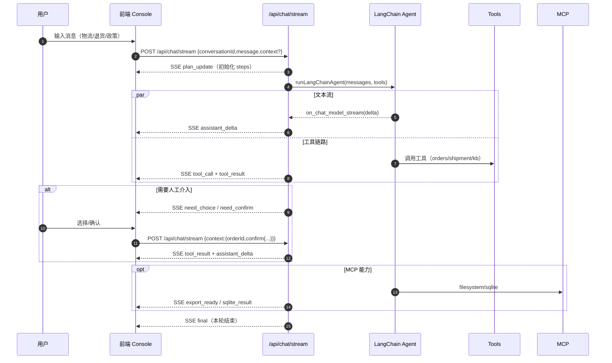

# simbaAgent 面试准备：架构总览与设计思路

本文面向技术面试官，系统梳理本项目的构造、链路与设计取舍，便于快速讲清楚“做了什么、为什么这么做、如何扩展”。

## 一、项目定位（30 秒电梯陈述）

- 一个可演示的电商售后智能客服工作台，包含 Inbox/Console 两页：会话处理、订单上下文、物流时间线、Plan/工具日志可视化。
- 后端通过 SSE 将 Agent 规划、工具调用与增量回复实时推送到前端；支持 MCP 扩展（会话导出、SQLite 审计）。
- 目前前端用 Vue 3 + JavaScript + Vite + Tailwind；Agent 链路基于 LangChain（DeepSeek/OpenAI 兼容）。

## 二、技术栈与目录锚点

- 前端：Vue 3 + Vue Router + JavaScript + Vite + Tailwind（入口与路由）
  - 入口：[index.html](file:///d:/code/study/simbaAgent/index.html) / [main.js](file:///d:/code/study/simbaAgent/src/main.js)
  - 路由：[router.js](file:///d:/code/study/simbaAgent/src/ui/router.js)
  - 页面：Inbox（[InboxPage.vue](file:///d:/code/study/simbaAgent/src/ui/pages/InboxPage.vue)）、Console（[ConsolePage.vue](file:///d:/code/study/simbaAgent/src/ui/pages/ConsolePage.vue)）
  - Console 子组件：
    - 聊天区（[ChatPanel.vue](file:///d:/code/study/simbaAgent/src/ui/pages/console/ChatPanel.vue)）
    - 输入区（[Composer.vue](file:///d:/code/study/simbaAgent/src/ui/pages/console/Composer.vue)）
    - 侧栏（订单/计划/工具日志/引用卡片/MCP）（[Sidebar.vue](file:///d:/code/study/simbaAgent/src/ui/pages/console/Sidebar.vue)）
    - SSE 解析（[sse.js](file:///d:/code/study/simbaAgent/src/ui/pages/console/sse.js)）
- 后端：Node.js + Express + TypeScript（tsx 运行）
  - 开发代理与构建：[vite.config.ts](file:///d:/code/study/simbaAgent/vite.config.ts) / [package.json](file:///d:/code/study/simbaAgent/package.json)
  - SSE 接口与传统 API：[server/index.ts](file:///d:/code/study/simbaAgent/server/index.ts)
  - SSE 工具函数：[server/sse.ts](file:///d:/code/study/simbaAgent/server/sse.ts)
  - LangChain Agent 与工具集：[server/langchainAgent.ts](file:///d:/code/study/simbaAgent/server/langchainAgent.ts)
  - MCP 客户端封装（filesystem/sqlite）：[server/mcpClients.ts](file:///d:/code/study/simbaAgent/server/mcpClients.ts)
- 演示数据与索引：
  - 样例数据（订单/包裹/消息/KB）：[sample-data.json](file:///d:/code/study/simbaAgent/data/milestone1/sample-data.json)

## 三、架构总览（组件/模块关系）

```mermaid
graph TD
  A[前端 Console (Vue 3)] -->|fetch POST| B[/api/chat/stream]
  B --> C[SSE 管线<br/>sendSseEvent(event,data)]
  C --> D[前端 SSE 解析器<br/>parseSseTextChunk]
  D --> A

  B -->|USE_LANGCHAIN=1| E[LangChain Agent<br/>ChatOpenAI + Tools]
  E -->|tool_call| B
  E -->|tool_result| B
  E -->|assistant_delta| B

  E --> F[业务工具 Tools<br/>orders/shipment/kb]
  E --> G[MCP 扩展<br/>filesystem/sqlite]

  subgraph 前端
    A1[ChatPanel]:::box
    A2[Sidebar]:::box
    A3[Composer]:::box
  end
  classDef box fill:#fff,stroke:#999,stroke-width:1px,rx:6;
```

要点：
- 后端不只推“文本流”，还推“过程事件”（Plan、工具日志、need\_choice/need\_confirm、MCP 结果），前端据此进行可观测可交互渲染。

## 四、一次对话的端到端流程（SSE 时序）



参考实现：
- SSE 初始化与事件写入：[sse.ts](file:///d:/code/study/simbaAgent/server/sse.ts)
- 入口接口与分支控制（LangChain / 演示）：[/api/chat/stream](file:///d:/code/study/simbaAgent/server/index.ts#L118-L149)
- Agent 流与工具事件派发：[langchainAgent.ts](file:///d:/code/study/simbaAgent/server/langchainAgent.ts#L1095-L1151)

## 五、前端设计（Console）

- 路由结构：[/inbox] → 会话列表；[/console/:conversationId] → 单会话处理（[router.js](file:///d:/code/study/simbaAgent/src/ui/router.js)）。
- SSE 消费：在 [ConsolePage.vue](file:///d:/code/study/simbaAgent/src/ui/pages/ConsolePage.vue#L149-L191) 中，用 `ReadableStream` 循环读取、经 [sse.js](file:///d:/code/study/simbaAgent/src/ui/pages/console/sse.js) 解析事件帧，按类型更新：
  - `assistant_delta` → ChatPanel 增量渲染
  - `plan_update` → Sidebar Plan 列表
  - `tool_call/tool_result` → 工具日志；当 `kbSearch` 成功时将 `hits` 渲染为“引用卡片”
  - `need_choice/need_confirm` → 弹窗交互
  - `export_ready/sqlite_result` → 结果卡片/表格
- UI 细节：
  - ChatPanel 保持“长对话可滚动”：父容器 `flex` + 子容器 `min-h-0 flex-1`（已修复）
  - KB 命中引用卡片：在 Sidebar 单独板块展示 `articleId/title/snippet/tags/updatedAt`，支持复制引用与清除

## 六、后端设计（Agent + Tools + MCP）

- SSE 接口：[/api/chat/stream](file:///d:/code/study/simbaAgent/server/index.ts#L118-L149)（Zod 校验 body，`USE_LANGCHAIN` 决定是否走 Agent 路径）。
- LangChain Agent：
  - 模型创建（DeepSeek/OpenAI 兼容）：[createModel](file:///d:/code/study/simbaAgent/server/langchainAgent.ts#L116-L153)
  - 工具集合：订单检索/详情、物流轨迹、KB 检索（RAG 演示），以及 MCP 工具（会话导出、SQLite 查询）
  - 事件派发：在工具内发送 `tool_call/tool_result`；在 `streamEvents` 中转发 `assistant_delta`
  - Human-in-the-loop：当需敏感操作时发送 `need_confirm`，二次确认后执行
- MCP：
  - filesystem：导出会话到 `exports/`（`export_ready` 返回路径）
  - sqlite：写入审计并查询（`sqlite_result` 返回 rows）

## 七、RAG 设计（演示级）

- 数据源：演示 KB 文档在 [sample-data.json: kbArticles](file:///d:/code/study/simbaAgent/data/milestone1/sample-data.json)。
- 工具：`kbSearch` 对 KB 做关键词检索，返回 `hits`（含 `articleId/title/snippet/tags/updatedAt`），并在前端以“引用卡片”呈现。
- 说明：该 RAG 为轻量演示，重点在“引用可观测 + UI 呈现”；可平滑替换为向量索引/语义检索后维持相同前端协议。

## 八、可观测性与安全

- 事件规范：所有过程使用 SSE 事件统一投递（`plan_update / tool_call / tool_result / assistant_delta / need_* / export_ready / sqlite_result / final`）。
- 脱敏：`inputRedacted/outputRedacted` 字段对工具入参/出参做脱敏封装，避免直接暴露敏感信息。
- 可追溯：`traceId/stepId/toolCallId` 串起一次请求内的工具链路。

## 九、配置与运行

- 本地开发：
  - `npm install` → `npm run dev`（前端 5173 / 后端 8787）
- 生产部署（单端口）：
  - `npm run build` → `NODE_ENV=production SERVE_STATIC=1 npm start`
- 环境变量：
  - `USE_LANGCHAIN=1` 开启 LangChain Agent
  - `USE_MCP=1` 开启 MCP（`MCP_SQLITE_URL` 指定 SQLite 文件）

## 十、可扩展路线

1) RAG 强化：接入向量库（FAISS/PGVector），保留 `kbSearch` 事件协议不变。
2) 工具治理：继续细分工具入参/出参 schema，构建工具市场与审计。
3) UI 提升：引用卡片支持“展开原文/片段高亮”，工具日志支持“复制入参/出参”。
4) 多模型路由：按意图与上下文动态路由 DeepSeek/OpenAI（cost/latency tradeoff）。

## 十一、常见问题（面试 Q&A）

- 问：为什么用 SSE 而不是 WebSocket？  
  答：SSE 实现更简单、天然单向流足够覆盖“从服务端到前端”的 Agent 输出场景；同时具备 HTTP 语义、好部署。双向交互由前端发起新的 HTTP 请求补足。

- 问：如何保证 Agent 输出的可解释性？  
  答：通过 `tool_call/tool_result` 明确呈现工具链路；KB 命中以“引用卡片”显示来源与要点；system prompt 要求回答必须带引用。

- 问：如何把演示 RAG 升级为真实生产？  
  答：保留 `kbSearch` 事件协议与卡片 UI，将实现从关键词检索替换为向量检索；同时在工具日志中注入命中评分、召回策略等字段。

---

更多细节可参考：
- SSE 要点：[要点.md](file:///d:/code/study/simbaAgent/%E8%A6%81%E7%82%B9.md)
- Agent + LangChain 流程说明：[docs/agent-langchain-flow.md](file:///d:/code/study/simbaAgent/docs/agent-langchain-flow.md)

先插入一条“空的 agent 消息”，是为了让“token 级增量流”有一个稳定的承载点，确保 UI 能做到以下三件事：

1) 稳定的 DOM 锚点，便于逐字追加
- 代码里先创建 `assistantMsgId`，把一条 `role: "agent", content: ""` 的消息 push 到 `messages`：
  - 这样模板里立刻渲染出一个空白的 Agent 气泡（有固定 key/id）
- 随着收到 `assistant_delta`，我们只需在内存里累计 `assistantDraft`，并找到这条消息，将 `content` 更新为新草稿：
  ```js
  if (ev.event === "assistant_delta") {
    assistantDraft += ev.data.delta;
    const idx = messages.value.findIndex((m) => m.messageId === assistantMsgId);
    if (idx !== -1) messages.value[idx] = { ...m, content: assistantDraft };
  }
  ```
- 因为消息对象的 key 不变，Vue 的虚拟 DOM 只会 patch 这条消息的内容，不会频繁创建/销毁节点，渲染更平滑。

2) 视觉连续：气泡位置和布局先确定，再填充内容
- 没有这一步，等第一段 delta 才创建消息，会出现“没有目标气泡可写、首帧闪烁”的体验。
- 先插空气泡后，布局（左对齐/右对齐、最大宽度、行高）立即确定，后续只改文本，整体视觉自然。

3) 与“工具日志/Plan 更新”并行不卡顿
- token 流期间，后端还会发 `plan_update/tool_call/tool_result` 等事件。
- 如果每来一个 delta 都新插一条消息，会引起列表频繁变更（插入/删除），和右侧日志更新交织，容易产生滚动抖动与重排。
- 先插空气泡 → 后面只“在这一条里改 content”，列表结构稳定 → 滚动/重排最小化。

可选对比（为什么不每个 delta 单独 push 一条消息？）
- 缺点：
  - 消息列表会暴涨，渲染成本更大
  - 滚动高度剧烈变化，影响“自动滚到底”体验
  - 需要在最后把一堆增量消息合并，逻辑更复杂
- 当前做法：
  - “一条消息 + 连续修改 content”即可，结构简单、性能更好、UI 连贯

小结
- 空 agent 消息 = 流式承载点（stable anchor）
- 收到 delta → 更新这条消息的 `content`
- 这样能平衡“可观测（Plan/工具日志并行显示）”与“良好交互（平稳滚动/无闪烁）”。

好的，用一套“时间轴 + DOM/响应式/滚动”的视角，把“为什么要先插一条空的 agent 消息”讲透。

**目标**
- SSE 返回的是“碎片化的 delta”（一次只来一小段文字）；UI 需要一个“稳定的承载点”把这些碎片持续拼起来，并且不打断布局/滚动。

**时间轴（一次发送的真实过程）**
- t0：你点“发送”
  - 写入一条用户消息（本地乐观渲染）
  - 立刻再写入一条空的 agent 消息（content=""，有固定 id）
  - 此时 messages.length 增加了 2；ChatPanel 渲染出一个“空白气泡”
- t1：后端开始流式推 delta（可能隔几百毫秒才到第一段）
  - 每来一段 delta，就把它拼到一个字符串 `assistantDraft` 上
  - 用 `assistantMsgId` 在 messages 里定位到这条空 agent 消息
  - 只更新这条消息的 content（把 `assistantDraft` 塞进去）
  - 因为是“同一条消息内容变了”，Vue 只 patch 这一条 DOM 节点，布局/滚动几乎不抖动
- t2：流式结束
  - `streaming=false`，这条 agent 消息的 content 已经是完整回答

**为什么不能等第一段 delta 才插这条消息？**
- 首帧闪烁/位移：等第一段到来才插，会在 delta 到达那一刻突然新增一个 DOM 节点（消息气泡），引起列表位移
- 滚动打断：新增节点那一刻会触发一次列表高度变化，和自动滚动的时机冲突，容易出现“本该在底部却略偏上”的体验
- 锚点不稳定：如果中途有系统提示（cs 消息）或其他消息插入，你再用“最后一条索引”去改 content 容易改错；我们用 `assistantMsgId` 精确定位，就算中途插入别的消息也不会乱

**为什么不能每个 delta 都 push 一条消息？**
- 列表暴涨：几十/上百条增量“子消息”，渲染/回收成本高
- 滚动抖动：每次 push 都影响高度，ChatPanel 的自动滚动更容易被打断
- 还要在末尾合并为一条完整消息，逻辑复杂

**这套做法在 Vue 里的三个“技术点”**
- 1) 虚拟 DOM patch 友好  
  预先创建一条“空消息”，后续只做“文本节点更新”，比“插入/删除节点”成本小得多
- 2) 响应式更新粒度可控  
  messages.length 只在 t0 增加一次；之后 delta 来了只是更新某条消息的 content，不会反复触发 `watch(messages.length)`，减少连锁重渲
- 3) 滚动逻辑更稳  
  ChatPanel 的自动滚动触发点是 `messages.length` 和 `streaming`：
  - 先插空消息 → `messages.length` 增加一次，滚到底
  - delta 期间不再增加长度 → 列表高度变化可预测，`maybeAutoScroll` 只因 `streaming` 的变化而触发
  - 用户上滑时 `locked=true`，即使 delta 继续更新 content 也不会强拉回底部

**代码关键位置（对应你项目）**
- 预插空消息（承载点）  
  在 send() 里：
  - 生成 `assistantMsgId`
  - `messages.value = [...messages.value, { messageId: assistantMsgId, role:"agent", content:"" }]`
- 拼接 delta（稳定更新）  
  在事件循环：
  - `assistantDraft += ev.data.delta`
  - `const idx = messages.value.findIndex(m => m.messageId === assistantMsgId)`
  - `messages[idx] = { ...m, content: assistantDraft }`
- 定位靠 id，而不是“最后一条”  
  即使期间插入了系统消息（比如点击“导出会话”），也不会更新错对象

**一句话总结**
- “空 agent 消息”就是流式的“挂钩点”：它让增量文本有稳定的容器、让虚拟 DOM 只做轻量 patch、让自动滚动不被节点插入打断、让中途追加的系统消息不干扰 delta 的归宿。这是实现“可观测、平滑”的关键步骤。